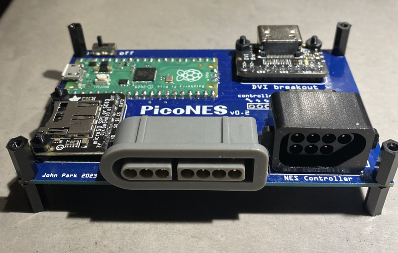
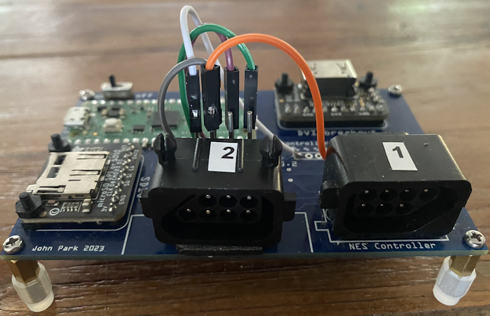

>[!NOTE]
> This README covers the old  version of the PCB (v0.2) and 3D-printed case. The zip file containing the latest PCB version can be found in the [PCB](../PCB) folder.

## PCB with Raspberry Pi Pico or Pico 2

Create your own little Pico Based NES console and play with an orginal (S)NES controller. 
Several Companies  can make these PCBs for you. 

I personally recommend [PCBWay](https://www.pcbway.com/). The boards i ordered from them are of excellent quality.

[](https://www.pcbway.com/)

When ordering, simply upload the zip file containing the design.  The zipfile can be found the [PCB/v0.2](../../PCB/v0.2) folder. 

> [!NOTE]
>  Soldering skills are required.

> [!NOTE]
> It seems that sellers on AliExpress have copied the PCB design and are selling pre-populated PCB's. I do not condone this in any way. For questions about those boards, please contact the seller on AliExpress.

Other materials needed:

- Raspberry Pi Pico or Pico 2 with no headers.
- on/off switch, like [this](https://www.kiwi-electronics.com/en/spdt-slide-switch-410?search=KW-2467) 
- [Adafruit DVI Breakout Board - For HDMI Source Devices](https://www.adafruit.com/product/4984)
- [Adafruit Micro SD SPI or SDIO Card Breakout Board - 3V ONLY!](https://www.adafruit.com/product/4682)
- Legacy game controller ports (You can use both, or one of them, depending what controller you have lying around)
  * NES Controller
    * [NES controller port](https://www.zedlabz.com/products/controller-connector-port-for-nintendo-nes-console-7-pin-90-degree-replacement-2-pack-black-zedlabz)
    * [An original NES controller](https://www.amazon.com/s?k=NES+controller&crid=1CX7W9NQQDF8H&sprefix=nes+controller%2Caps%2C174&ref=nb_sb_noss_1)
  * SNES Controller (This connects to player 1)
    * [SNES controller port](https://www.zedlabz.com/products/zedlabz-7-pin-90-degree-female-controller-connector-port-for-nintendo-snes-console-2-pack-grey).
    * [An original SNES controller](https://www.amazon.com/s?k=original+snes+controller&sprefix=original+SNES+%2Caps%2C174&ref=nb_sb_ss_ts-doa-p_1_14)
- (Optional) a second NES controller and controller port if you want to play two player games.
- [Micro usb to OTG Y-Cable](https://a.co/d/b9t11rl) if you want to use a Dualshock/Dualsense controller.
- Micro USB power supply.

For two player setup you need an extra NES controller port. You must solder the GPIO connections directly onto the pico.

|           | Port 2 (Optional) | Note |
| ------------- | ---- |  ---------- |
| GND           |      |  ground via on PCB |
| VCC (Power)   |      |  VCC via on PCB         |
| NES Clock     | GPIO9 |          |
| NES LATCH     | GPIO11|        |
| NES Data      | GPIO10|        |

When using a Pico, Flash **piconesPlusAdaFruitDVISD.uf2** the from the [releases page](https://github.com/fhoedemakers/pico-infonesPlus/releases/latest). 
When using a Pico 2 flash **pico2_piconesPlusAdaFruitDVISD.uf2** instead.


### Image: one or two player setup with usb controller and NES/SNES controller port

For single player games, connect either an USB controller **or** a (S)NES controller. Not both!

For two player games: Connect a USB controller for player 1 and a NES/SNES controller for player 2.



### Image: Two player setup using two NES controllers or a USB controller and a NES controller

Choose either of the following:

- Connect two NES controllers 
- Connect a USB controller for player 1 and a NES controller for player 2. You can use either NES controller ports.

For NES port 2: clock, data and latch soldered directly on the Pico. Ground and vcc soldered on the pcb.



### 3D printed case

[DynaMight1124](https://github.com/DynaMight1124) designed a NES-like case you can 3d-print as enclosure for this pcb. This enclosure is suitable for one NES controller port. [Click here for the design](https://www.thingiverse.com/thing:6689537). Please contact the creator on his thingiverse page if you have any questions about this case.

For two player games: Connect a USB controller for player 1 and a NES controller for player2.


***
```
