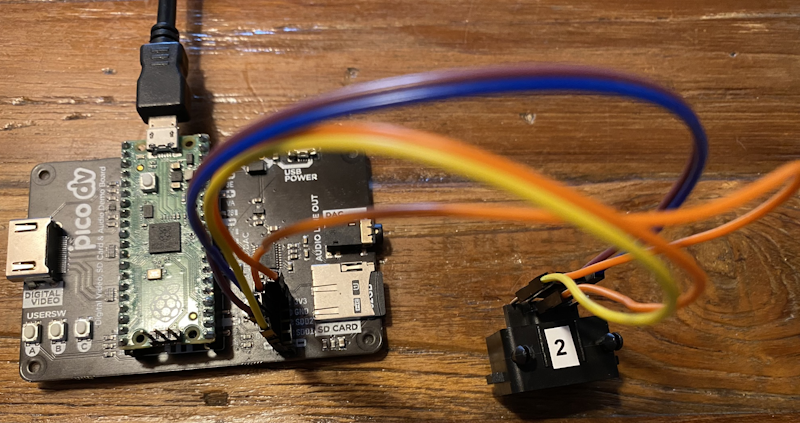
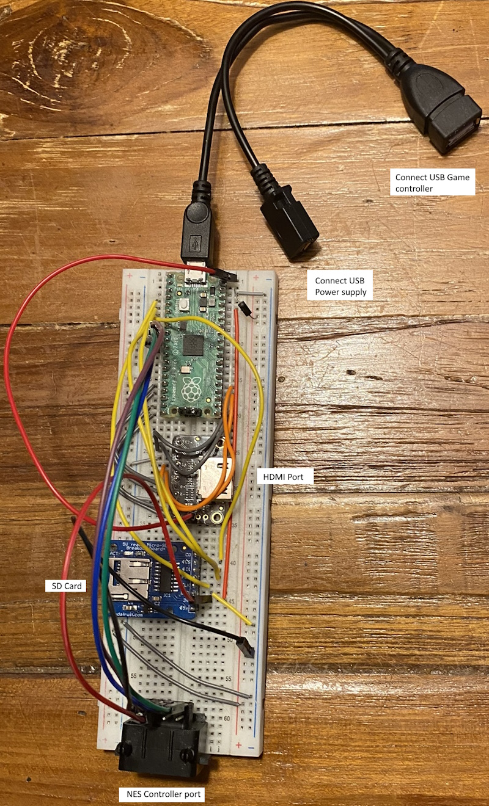
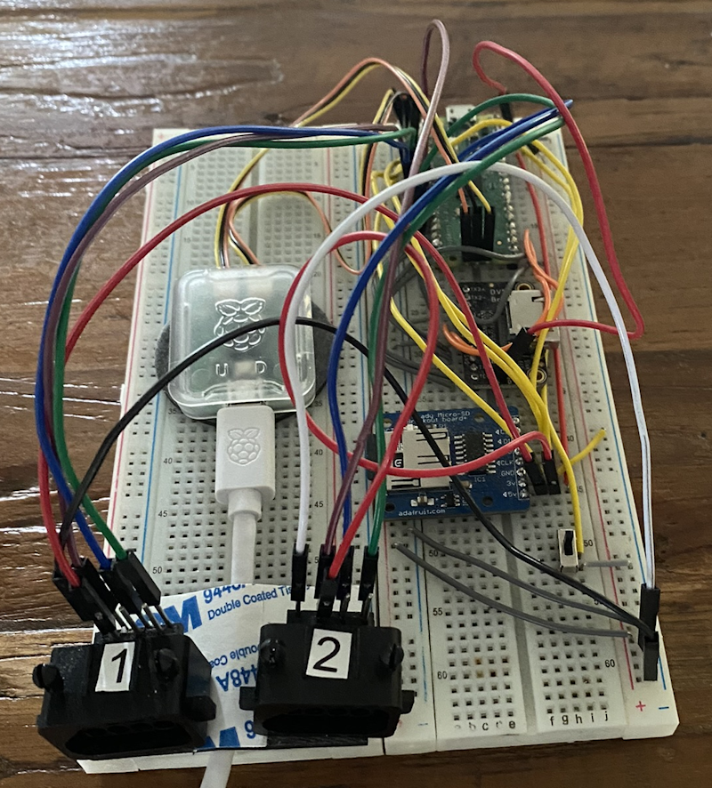
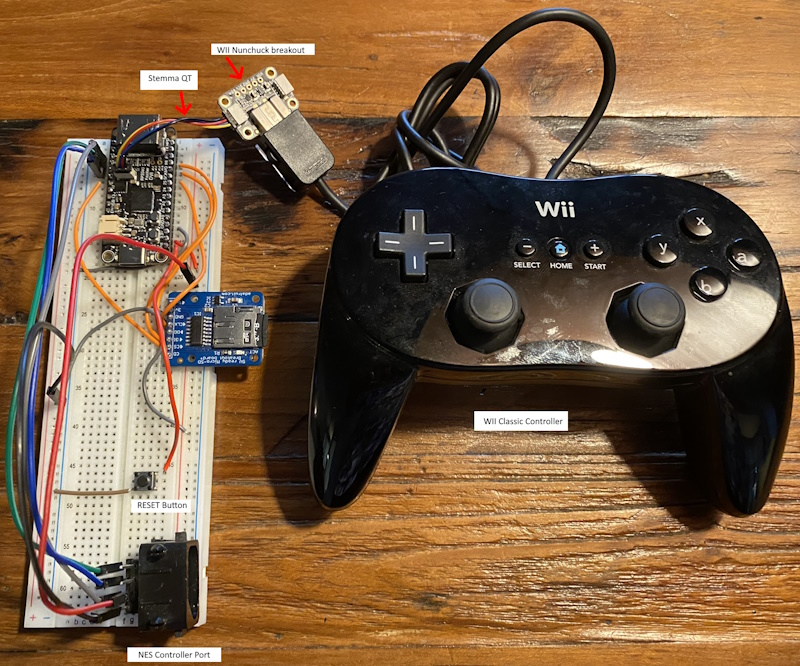
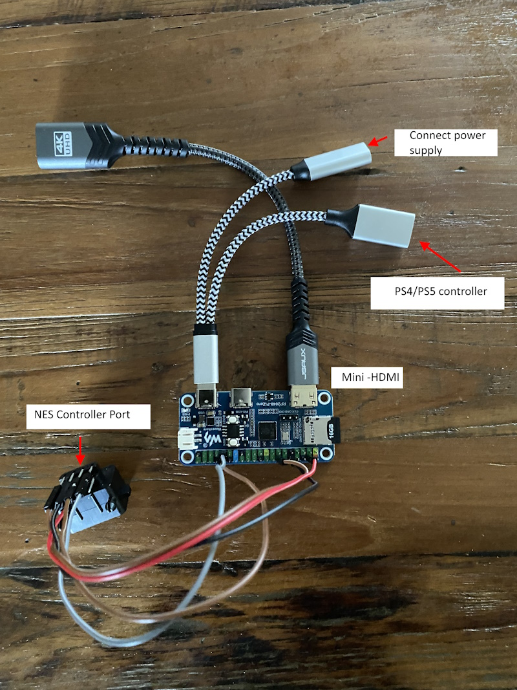
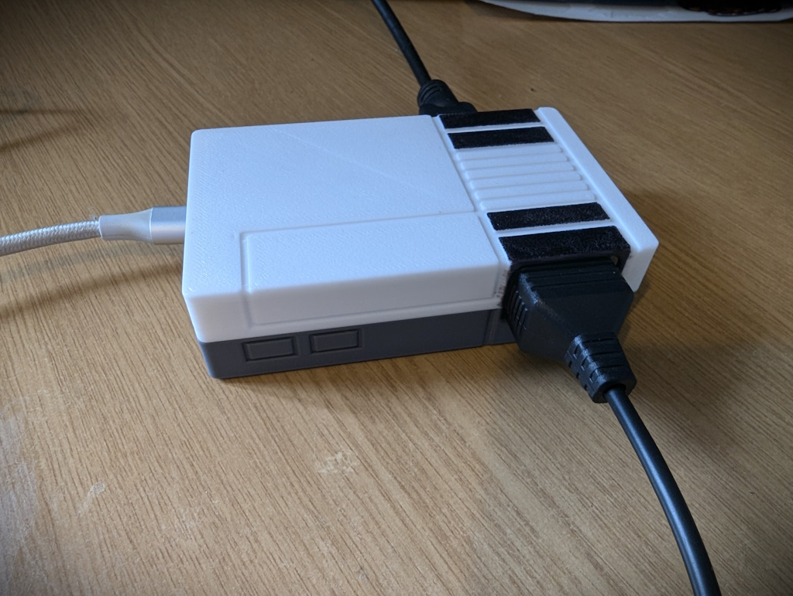
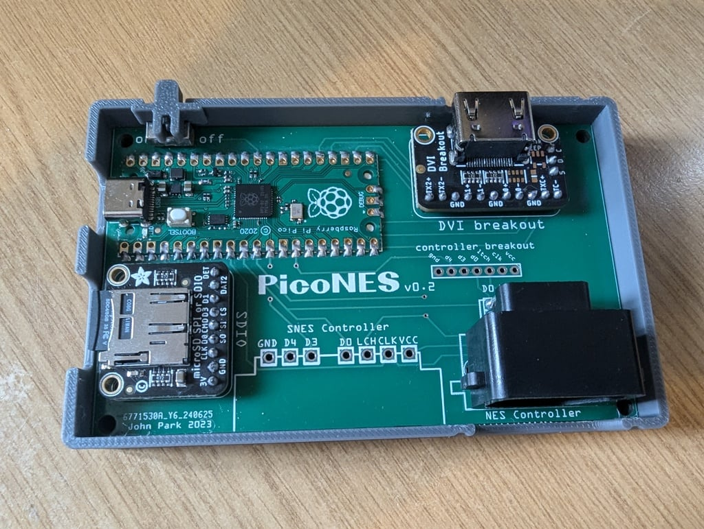

# pico-infonesPlus.

## Introduction

> [A more comprehensive guide from Adafruit can be found here](https://learn.adafruit.com/nes-emulator-for-rp2040-dvi-boards)

A NES (Nintendo Entertainment System) emulator for RP2040 based microcontrollers with SD card and menu support. Uses HDMI for display. 

Supports two controllers for two player games. [See "about two player games" below for specifics and limitations](#about-two-player-games) 

The emulator used is  [Infones by Jay Kumogata](https://github.com/jay-kumogata/InfoNES) which was ported to the [Raspberry Pi Pico by Shuichi Takano](https://github.com/shuichitakano/pico-infones) with changes done by me to accomodate the SD card menu.

In stead of flashing a NES rom to the Pico using picotool, you create a FAT32 formatted SD card and copy your NES roms on to it. It is possible to organize your roms into different folders. Then insert the SD Card into the card slot. Needless to say you must own all the roms you put on the card.

A menu is added to the emulator, which reads the roms from the SD card and shows them on screen for the user to select,  flash and play.

> There is also an emulator port for the Sega Master System/Sega Game Gear. You can find it here [https://github.com/fhoedemakers/pico-smsplus](https://github.com/fhoedemakers/pico-smsplus)

***

## Video
Click on image below to see a demo video.

[](https://www.youtube.com/watch?v=OEcpNMNzZCQ)

***

## Possible configurations

You can use it with these RP2040 boards and configurations:

- Raspberry Pi Pico. Requires one of these addons:
  - [Pimoroni Pico DV Demo Base](https://shop.pimoroni.com/products/pimoroni-pico-dv-demo-base?variant=39494203998291) hdmi add-on board. For use with a USB gamecontroller or a legacy NES controller. (NES controller port requires soldering)
  - Breadboard and
    - [Adafruit DVI Breakout For HDMI Source Devices](https://www.adafruit.com/product/4984)
    - [Adafruit Micro-SD breakout board+](https://www.adafruit.com/product/254).
      
    For use with a USB gamecontroller or a legacy NES controller. (No soldering requirerd)
    
  - A custom printed circuit board (PCB) designed by [@johnedgarpark](https://twitter.com/johnedgarpark). (requires soldering) A NES or SNES controller port can be added to this PCB. Can also be used with a USB gamecontroller. [You can 3d print your own NES-like case for the PCB](https://www.thingiverse.com/thing:6689537). 

- [Adafruit Feather RP2040 with DVI](https://www.adafruit.com/product/5710) (HDMI) Output Port. For use with a USB gamecontroller or a legacy NES controller, or even a WII classic controller. Requires these addons:
  - Breadboard
  - SD reader  (choose one below)
    - [Adafruit Micro-SD breakout board+](https://www.adafruit.com/product/254).
    - [FeatherWing - RTC + SD](https://www.adafruit.com/product/2922). (not tested by me, but should work)
   
- [Waveshare RP2040-PiZero Development Board](https://www.waveshare.com/rp2040-pizero.htm)

  For use with a USB gamecontroller or a legacy NES controller. (No soldering requirerd)
    

[See below to see how to setup your specific configuration.](#Setup)

***

## Gamecontroller support
Depending on the hardware configuration, the emulator supports these gamecontrollers:

- Raspberry Pi Pico
  - USB controllers
    - Sony Dual Shock 4
    - Sony Dual Sense
    - BUFFALO BGC-FC801 connected to USB - not tested
  - Legacy Controllers
    - One or optional two original NES controllers.  Requires soldering when using Pico DV Demo Base or Printed Circuit Board.
    - An original SNES controller. PCB Only. Connects to controller port 1.
    - WII-classic controller. Breadboard only. Not tested - should work
- Adafruit Feather RP2040 with DVI (HDMI)
  - USB controllers
    - Sony Dual Shock 4
    - Sony Dual Sense
    - BUFFALO BGC-FC801 connected to USB - not tested
  - Legacy Controllers
    - One or optional two original NES controllers.
    - WII-classic controller.
- Waveshare RP2040-PiZero Development Board
  - USB controllers
    - Sony Dual Shock 4
    - Sony Dual Sense
    - BUFFALO BGC-FC801 connected to USB - not tested
  - Legacy Controllers
    - One or optional two original NES controllers.
      
When using Legacy Controllers, you can choose between:
  * NES Controller. (Second controller port and controller is optional and only needed if you want to play two player games)
    * [NES controller port](https://www.zedlabz.com/products/controller-connector-port-for-nintendo-nes-console-7-pin-90-degree-replacement-2-pack-black-zedlabz)
    * [An original NES controller](https://www.amazon.com/s?k=NES+controller&crid=1CX7W9NQQDF8H&sprefix=nes+controller%2Caps%2C174&ref=nb_sb_noss_1)
  * SNES Controller (PCB only, connects to controller port 1)
    * [SNES controller port](https://www.zedlabz.com/products/zedlabz-7-pin-90-degree-female-controller-connector-port-for-nintendo-snes-console-2-pack-grey)
    * [An original SNES controller](https://www.amazon.com/s?k=original+snes+controller&sprefix=original+SNES+%2Caps%2C174&ref=nb_sb_ss_ts-doa-p_1_14). 

  * WII-Classic controller 
    *  [Adafruit Wii Nunchuck Breakout Adapter - Qwiic / STEMMA QT](https://www.adafruit.com/product/4836)
    *  [Adafruit STEMMA QT / Qwiic JST SH 4-pin Cable](https://www.adafruit.com/product/4210)
    *  [WII Classic wired controller](https://www.amazon.com/Classic-Controller-Nintendo-Wii-Remote-Console/dp/B0BYNHWS1V/ref=sr_1_1_sspa?crid=1I66OX5L05507&keywords=Wired+WII+Classic+controller&qid=1688119981&sprefix=wired+wii+classic+controller%2Caps%2C150&sr=8-1-spons&sp_csd=d2lkZ2V0TmFtZT1zcF9hdGY&psc=1)

***

## About two player games

The emulator supports two player games using two NES controllers or an USB gamecontroller and a NES controller connected to controller port of player 2. The USB controller is always player 1.

> [!NOTE]
> You cannot use two USB controllers for two player mode.
>  At the moment only one USB controller is recognized by the driver.
> The second controller must be a NES controller. In this config the NES controller port must be wired up to the GPIO pins of player 2. See configurations below.

***

## Warning
Repeatedly flashing your Pico will eventually wear out the flash memory. 

The emulator overclocks the Pico in order to get the emulator working fast enough. Overclocking can reduce the Pico's lifespan.

Use this software at your own risk! I will not be responsible in any way for any damage to your Pico and/or connected peripherals caused by using this software.

I also do not take responsability in any way when damage is caused to the Pico or display due to incorrect wiring or voltages.

***

# Setup

Click on the link below for your specific board configuration:

- [Raspberry Pi Pico, setup for Pimoroni Pico DV Demo Base](#raspberry-pi-pico-setup-for-pimoroni-pico-dv-demo-base)
- [Raspberry Pi Pico, setup with Adafruit hardware and breadboard](#raspberry-pi-pico-setup-with-adafruit-hardware-and-breadboard)
- [Adafruit Feather RP2040 with DVI (HDMI) Output Port setup](#adafruit-feather-rp2040-with-dvi-hdmi-output-port-setup)
- [Waveshare RP2040-PiZero Development Board](#waveshare-rp2040-pizero-development-board)
- [Printed Circuit Board with Raspberry Pi Pico](#pcb-with-raspberry-pi-pico)

***

##  Raspberry Pi Pico, setup for Pimoroni Pico DV Demo Base.

### materials needed
- Raspberry Pi Pico with soldered male headers.
- [Pimoroni Pico DV Demo Base](https://shop.pimoroni.com/products/pimoroni-pico-dv-demo-base?variant=39494203998291).
- [Micro usb to usb OTG Cable](https://a.co/d/dKW6WGe)
- Controllers (Depending on what you have)
  - Dual Shock 4 or Dual Sense Controller.
  - NES Controller:
    - [NES controller port](https://www.zedlabz.com/products/controller-connector-port-for-nintendo-nes-console-7-pin-90-degree-replacement-2-pack-black-zedlabz). Requires soldering.
    - [An original NES controller](https://www.amazon.com/s?k=NES+controller&crid=1CX7W9NQQDF8H&sprefix=nes+controller%2Caps%2C174&ref=nb_sb_noss_1)
    - Optional: A sconde NES controller port and controller if you want to play two player games.
    - [Dupont wires](https://a.co/d/cJVmnQO)
    - [Mail or female headers to be soldered on the board](https://a.co/d/dSNPuyo)
- HDMI Cable.
- Micro usb power adapter.
- Micro usb to usb cable when using the Duak Shock 4 controller
- USB C to USB data cable when using the Sony Dual Sense controller.
- FAT 32 formatted Micro SD card with roms you legally own. Roms must have the .nes extension. You can organise your roms into different folders.


### flashing the Pico
- Download **piconesPlusPimoroniDV.uf2** from the [releases page](https://github.com/fhoedemakers/pico-infonesPlus/releases/latest).
- Push and hold the BOOTSEL button on the Pico, then connect to your computer using a micro usb cable. Release BOOTSEL once the drive RPI-RP2 appears on your computer.
- Drag and drop the UF2 file on to the RPI-RP2 drive. The Raspberry Pi Pico will reboot and will now run the emulator.

### Pinout

#### NES controller port(s) (if you want to use legacy NES controllers).


|          | Port 1 | Port 2 (optional) |Note  |
| ------------- | ------------- | ------------- | ----------- |
| GND           |               |               | GND (- on board) |
| VCC (Power)   |               |               | Connect to 3V3  |
| NES Clock     | GPIO14        |    GPIO1      |             | 
| NES LATCH     | GPIO16        |    GPIO20     |             |
| NES Data      | GPIO15         |   GPIO21     |             |

> [!NOTE]
> Soldering is required.
> There is only one 3v3 pin header on the board, the other 3V3 must be soldered directly onto pin 36 (3V3 OUT) of the Pico.
> For GND there are two pin headers available on the board.
> Clock Data and Latch for controller one must be soldered directly onto the Pico.
> The Clock, Data and Latch for the second controller can be soldered on the available pin headers on the board, no need to solder them directly onto the Pico.


### setting up the hardware
- Disconnect the Pico from your computer.
- Attach the Pico to the DV Demo Base.
- Connect the HDMI cable to the Demo base and your monitor.
- Connect the usb OTG cable to the Pico's usb port.
- Depending which controller you want to use:
  - Connect the controller to the other end of the usb OTG.
  - Connect legacy NES controller(s) to NES controller port(s).
- Insert the SD card into the SD card slot.
- Connect the usb power adapter to the usb port of the Demo base. (USB POWER)
- Power on the monitor and the Pico

### Image: Usb controller only


### Image: two player setup, usb controller and NES controller port

USB controller is player 1, NES controller is player two and must be wired to controller port 2.




***

## Raspberry Pi Pico, setup with Adafruit hardware and breadboard

### materials needed
- Raspberry Pi Pico with soldered male headers.
- [Adafruit DVI Breakout For HDMI Source Devices](https://www.adafruit.com/product/4984)
- [Adafruit Micro-SD breakout board+](https://www.adafruit.com/product/254)
- [Micro usb to OTG Y-Cable](https://a.co/d/b9t11rl)
- [Breadboard](https://www.amazon.com/s?k=breadboard&crid=1E5ZFUFWE6HNI&sprefix=breadboard%2Caps%2C167&ref=nb_sb_noss_2)
- [Breadboard jumper wires](https://a.co/d/2NoWOgK)
- Controllers (Depending on what you have)
  - NES controller
    - [NES controller port](https://www.zedlabz.com/products/controller-connector-port-for-nintendo-nes-console-7-pin-90-degree-replacement-2-pack-black-zedlabz)
    - [An original NES controller](https://www.amazon.com/s?k=NES+controller&crid=1CX7W9NQQDF8H&sprefix=nes+controller%2Caps%2C174&ref=nb_sb_noss_1)
    - [Dupont male to female wires](https://a.co/d/cJVmnQO)
  - Dual Shock 4 or Dual Sense Controller.
- HDMI Cable.
- Micro usb power adapter.
- Usb C to usb cable when using the Sony Dual Sense controller.
- Micro usb to usb cable when using a Dual Shock 4.
- FAT 32 formatted Micro SD card with roms you legally own. Roms must have the .nes extension. You can organize your roms into different folders.


### flashing the Pico
- Download **piconesPlusAdaFruitDVISD.uf2** from the [releases page](https://github.com/fhoedemakers/pico-infonesPlus/releases/latest).
- Push and hold the BOOTSEL button on the Pico, then connect to your computer using a micro usb cable. Release BOOTSEL once the drive RPI-RP2 appears on your computer. Or when already powered-on. Press and hold BOOTSEL, then press RUN on the board.
- Drag and drop the UF2 file on to the RPI-RP2 drive. The Raspberry Pi Pico will reboot and will now run the emulator.

### Pinout 

See https://www.raspberrypi.com/documentation/microcontrollers/images/pico-pinout.svg for the pinout schema of the Raspberry Pi Pico.

Use the breadboard to connect all together:

- Wire Pico Pin 38 to the breadboard ground column (-)
- Wire the breadboard left ground column (-) with the breadboard right ground column (-)

#### Adafruit Micro-SD breakout board+

|  Breakout     | GPIO   | Note     |
| ------------- | ------ | -------------- |
| CS            | GPIO5    |               |
| CLK (SCK)     | GPIO2    |               |
| DI (MOSI)     | GPIO3    |               |
| DO (MISO)     | GPIO4    |               |
| 3V            |        | Pin 36 (3v3 OUT)            |
| GND           |        | Ground on breadboard (-) |

#### Adafruit DVI Breakout For HDMI Source Devices

|  Breakout     | GPIO | Note|
| ------------- | ---- | ---------- |
| D0+           | GPIO12 |         |
| D0-           | GPIO13 |         |
| CK+           | GPIO14 |         |
| CK-           | GPIO15 |         |
| D2+           | GPIO16 |         |
| D2-           | GPIO17 |         |
| D1+           | GPIO18 |         |
| D1-           | GPIO19 |         |
| 5 (*)         | VBUS | Pin 40 (5volt) |
| GND (3x)      |      | Ground on breadboard (-)     |

(*) This is the via on the side of the board marked 5. (next to via D and C). 


#### NES controller port(s). (if you want to use legacy NES controllers).
|           | Port1 | Port 2 (optional) | Note |
| ------------- | ---- | -------- |---------- |
| GND           |      | | |Ground on breadboard (-) |
| VCC (Power)   |      |   |(3v3 OUT)        |
| NES Clock     | GPIO6  | GPIO9 |          |
| NES LATCH     | GPIO8  | GPIO11 |          |
| NES Data      | GPIO7  | GPIO10 |          |


### setting up the hardware

- Disconnect the Pico from your computer.
- Attach the Pico to the breadboard.
- Insert the SD card into the SD card slot.
- Connect the HDMI cable to the Adafruit HDMI Breakout board and to your monitor.
- Connect the usb OTG Y-cable to the Pico's usb port.
- Connect the controller to the full size female usb port of the OTG Y-Cable.
- Controllers (Depending on what you have)
  - Connect the Micro usb power adapter to the female Micro usb connecter of the OTG Y-Cable.
  - Connect your NES controller to the NES controller port.
- Power on the monitor and the Pico

See image below. 

> [!NOTE]
> The Shotky Diode (VSYS - Pin 39 to breadboard + column) and the wire on breadboard left (+) to right (+) are not necessary, but recommended when powering the Pico from a Raspberry Pi.
> [See Chapter 4.6 - Powering the Board of the Raspberry Pi Pico Getting Started guide](https://datasheets.raspberrypi.com/pico/getting-started-with-pico.pdf) 

### Image: One player setup only

USB controller and NES controller ar both player 1



### Image: Two player setup using NES controllers
(You can also connect an USB controller and a NES controller to port 2)

> [!NOTE]
> The device on the left is a Pico Debug probe used for debugging. This is optional



***

##  Adafruit Feather RP2040 with DVI (HDMI) Output Port setup

### materials needed

- [Adafruit Feather RP2040 with DVI (HDMI) Output Port](https://www.adafruit.com/product/5710)
- SD Reader (Choose one below)
  * [Adafruit Micro-SD breakout board+](https://www.adafruit.com/product/254) together with a breadboard.
  * [FeatherWing - RTC + SD](https://www.adafruit.com/product/2922) - not tested by me, but should work.
- [Breadboard](https://www.amazon.com/s?k=breadboard&crid=1E5ZFUFWE6HNI&sprefix=breadboard%2Caps%2C167&ref=nb_sb_noss_2)
- [Breadboard jumper wires](https://a.co/d/2NoWOgK)
- USB-C to USB data cable.
- HDMI Cable.
- FAT 32 formatted Micro SD card with roms you legally own. Roms must have the .nes extension. You can organise your roms into different folders.
- Optional: a push button like [this](https://www.kiwi-electronics.com/nl/drukknop-12mm-10-stuks-403?country=NL&utm_term=403&gclid=Cj0KCQjwho-lBhC_ARIsAMpgMoeZIyZD1ZW5GKC0r7iTBCxEP84dIZLqFfoup1D0XNOnpevkp06oyDoaAojJEALw_wcB).

When using a USB gamecontroller this is needed:
- [USB C male to micro USB female cable](https://www.amazon.com/Adapter-Connector-Charging-Compatible-Z3-Black/dp/B07Z9FLJG3/ref=sr_1_5?keywords=usb+c+male+to+micro+usb+female&qid=1688473279&sprefix=usb+c+male+to+micro+%2Caps%2C159&sr=8-5)
- [Micro usb to OTG Y-Cable](https://a.co/d/b9t11rl)
- Micro usb power adapter
- Usb C to usb cable when using the Sony Dual Sense controller.
- Micro usb to usb cable when using a Dual Shock 4.

When using legacy controllers, this is needed:
  * USB-C Power supply   
  * Depending on what you have:
    * NES Controller
      * [NES controller port](https://www.zedlabz.com/products/controller-connector-port-for-nintendo-nes-console-7-pin-90-degree-replacement-2-pack-black-zedlabz)
      * [An original NES controller](https://www.amazon.com/s?k=NES+controller&crid=1CX7W9NQQDF8H&sprefix=nes+controller%2Caps%2C174&ref=nb_sb_noss_1)
      * [Dupont male to female wires](https://a.co/d/cJVmnQO)
    * WII-Classic controller
      *  [Adafruit Wii Nunchuck Breakout Adapter - Qwiic / STEMMA QT](https://www.adafruit.com/product/4836)
      *  [Adafruit STEMMA QT / Qwiic JST SH 4-pin Cable](https://www.adafruit.com/product/4210)
      *  [WII Classic wired controller](https://www.amazon.com/Classic-Controller-Nintendo-Wii-Remote-Console/dp/B0BYNHWS1V/ref=sr_1_1_sspa?crid=1I66OX5L05507&keywords=Wired+WII+Classic+controller&qid=1688119981&sprefix=wired+wii+classic+controller%2Caps%2C150&sr=8-1-spons&sp_csd=d2lkZ2V0TmFtZT1zcF9hdGY&psc=1)
  

### flashing the Feather RP2040
- Download **piconesPlusFeatherDVI.uf2** from the [releases page](https://github.com/fhoedemakers/pico-infonesPlus/releases/latest).
- Connect the feather to a USB port on your computer using the USB-C data cable.
- On the feather, push and hold the BOOTSEL button, then press RESET. Release the buttons, the drive RPI-RP2 should appear on your computer.
- Drag and drop the UF2 file on to the RPI-RP2 drive. The Raspberry Pi Pico will reboot and will now run the emulator.

### Pinout 
See: https://learn.adafruit.com/assets/119662 for the Feather pin scheme.

Use the breadboard to connect all together:

- Wire the 3.3V Pin to the breadboard + column.
- Wire the GND Pin to the breadboard - column
- Wire the breadboard left ground column (-) with the breadboard right ground column (-)
- Optional: Attach a push button to the breadboard and connect a wire from this button to the Feather RST pin and breadboard ground column(-). This adds an extra easy to access Reset button.

#### Adafruit Micro-SD breakout board+

|  Breakout     | GPIO   |      |
| ------------- | ------ | -------------- |
| CS            | GPIO10    |              |
| CLK (SCK)     | GPIO14    |               |
| DI (MOSI)     | GPIO15   |               |
| DO (MISO)     | GPIO8   |               |
| 3V            |        | + column on breadboard connected to feather 3.3V pin         |
| GND           |        | - column on breadboard connected to feather ground pin|

#### WII  nunchuck breakout adapter.

Connect the nunchuck breakout adapter to the Feather DVI using the STEMMA QT cable.

#### NES controller port(s). (if you want to use legacy NES controllers).

|               | Port 1 | Port 2 (optional) | Note |
| ------------- | ---- | ------ | ---------- |
| GND           |      | | - column on breadboard connected to feather ground pin |
| VCC (Power)   |      | | + column on breadboard connected to feather 3.3V pin         |
| NES Clock     | GPIO5 | GPIO26 |          |
| NES LATCH     | GPIO9 | GPIO27 |        |
| NES Data      | GPIO6 | GPIO28 |        |


### setting up the hardware

- Disconnect the Pico from your computer.
- Attach the Adafruit Feather RP2040 DVI to the breadboard.
- Insert the SD card into the SD card slot.
- Connect the HDMI cable to the HDMI port of the Adafruit Feather and to your monitor.
- Connect controllers depending on your setup:
  - Legacy controllers.
    - NES Controller to the NES controller port.
    - WII-Classic controller to the Nunchuck Breakout Adapter.
    - Connect USB-C power supply to USB-C connector.
  - USB game Controllers
    * Connect the USB C connector of the "male USB C to female micro usb cable" to the USB C port of the feather.
    * Connect the female micro USB port of the "male USB C to female micro usb cable" to the male micro USB port of the USB OTG Y cable.
    * Connect the Dual Sense or Dual Shock controller with the appropriate cable to the full size female usb port of the OTG Y-Cable.
    * Connect the Micro usb power adapter to the female Micro usb connecter of the OTG Y-Cable.
- Power on the monitor and the Pico

### Image: One player setup only

USB, NES and WII-Classic are player 1



### Image: Two player setup

Player 2 is NES controller port 2


***

## Waveshare RP2040-PiZero Development Board

### materials needed

- [Waveshare RP2040-PiZero Development Board](https://www.waveshare.com/rp2040-pizero.htm).
- [USB-C to USB-C - USB-A Y cable](https://a.co/d/eteMZLt). (when using an USB controller)
- [USB-C to USB-A cable](https://a.co/d/2i7rJid) for flashing the uf2 onto the board.
- USB-C Power supply. Connect to the port labelled USB, not PIO-USB.
- [Mini HDMI to HDMI Cable](https://a.co/d/5BZg3Z6).
- FAT 32 formatted Micro SD card with roms you legally own. Roms must have the .nes extension. You can organise your roms into different folders.

> [!NOTE]
> When using an USB controller, connect the controller and the power adapter to the Y cable. Connect the Y-cable to the port on the board labelled USB. I do not recommend powering the board via the PIO-USB port. This caused some weird behaviour.

#### NES controller port.

When using a original NES controller you need:

- [NES controller port](https://www.zedlabz.com/products/controller-connector-port-for-nintendo-nes-console-7-pin-90-degree-replacement-2-pack-black-zedlabz)
- [An original NES controller](https://www.amazon.com/s?k=NES+controller&crid=1CX7W9NQQDF8H&sprefix=nes+controller%2Caps%2C174&ref=nb_sb_noss_1)
- [Dupont female to female wires](https://a.co/d/cJVmnQO)

For two player setup you need an extra NES controller port, controller and wire


|           | Port 1 | Port 2 (Optional) | Note |
| ------------- | ---- | ----- | ---------- |
| GND           |      | | Any ground pin |
| VCC (Power)   |      | | 5Volt pin         |
| NES Clock     | GPIO5 | GPIO10 |          |
| NES LATCH     | GPIO9 | GPIO11|        |
| NES Data      | GPIO6 | GPIO12|        |

> [!NOTE]
> Contrary to other configurations where VCC is connected to 3Volt, VCC should be connected to a 5Volt pin. Otherwise the NES controller could possibly not work.


### flashing the Waveshare RP2040-PiZero Development Board
- Download **piconesPlusWsRP2040PiZero.uf2** from the [releases page](https://github.com/fhoedemakers/pico-infonesPlus/releases/latest).
- Connect the USB-C port marked USB (not PIO-USB) to a USB port on your computer using the USB-C to USB-A data cable.
- On the board, push and hold the BOOT button, then press RUN. Release the buttons, the drive RPI-RP2 should appear on your computer.
- Drag and drop the UF2 file on to the RPI-RP2 drive. The board will reboot and will now run the emulator.


> Note: When the emulator won't start and the screen shows "No signal", press the run button once again. The emulator will now boot.

### Image: One player setup only

USB and NES are player 1




### Image: Two player setup using NES controllers

(You can also connect an USB controller and a NES controller to port 2)


***

## PCB with Raspberry Pi Pico

> Note: Soldering skills are required.

Create your own little Pico Based NES console and play with an orginal (S)NES controller. 
The PCB design files can be found in the [assets/pcb](https://github.com/fhoedemakers/pico-infonesPlus/tree/main/assets/pcb) folder. Several Companies  can make these PCBs for you. 

I personally recommend [PCBWay](https://www.pcbway.com/). The boards i ordered from them are of excellent quality.

[](https://www.pcbway.com/)

Simply upload the design files packed as a [zip archive](https://github.com/fhoedemakers/pico-infonesPlus/releases/latest) when ordering. A zip file containing the design files can be found on the [releases page](https://github.com/fhoedemakers/pico-infonesPlus/releases/latest).

Other materials needed:

- Raspberry Pi Pico with no headers.
- on/off switch, like [this](https://www.kiwi-electronics.com/en/spdt-slide-switch-410?search=KW-2467) 
- [Adafruit DVI Breakout Board - For HDMI Source Devices](https://www.adafruit.com/product/4984)
- [Adafruit Micro SD SPI or SDIO Card Breakout Board - 3V ONLY!](https://www.adafruit.com/product/4682)
- Legacy game controller ports (You can use both, or one of them, depending what controller you have lying around)
  * NES Controller
    * [NES controller port](https://www.zedlabz.com/products/controller-connector-port-for-nintendo-nes-console-7-pin-90-degree-replacement-2-pack-black-zedlabz)
    * [An original NES controller](https://www.amazon.com/s?k=NES+controller&crid=1CX7W9NQQDF8H&sprefix=nes+controller%2Caps%2C174&ref=nb_sb_noss_1)
  * SNES Controller (This connects to player 1)
    * [SNES controller port](https://www.zedlabz.com/products/zedlabz-7-pin-90-degree-female-controller-connector-port-for-nintendo-snes-console-2-pack-grey).
    * [An original SNES controller](https://www.amazon.com/s?k=original+snes+controller&sprefix=original+SNES+%2Caps%2C174&ref=nb_sb_ss_ts-doa-p_1_14)
- (Optional) a second NES controller and controller port if you want to play two player games.
- [Micro usb to OTG Y-Cable](https://a.co/d/b9t11rl) if you want to use a Dualshock/Dualsense controller.
- Micro USB power supply.

For two player setup you need an extra NES controller port. You must solder the GPIO connections directly onto the pico.

|           | Port 2 (Optional) | Note |
| ------------- | ---- |  ---------- |
| GND           |      |  ground via on PCB |
| VCC (Power)   |      |  VCC via on PCB         |
| NES Clock     | GPIO9 |          |
| NES LATCH     | GPIO11|        |
| NES Data      | GPIO10|        |

Flash the Pico with **piconesPlusAdaFruitDVISD.uf2** from the [releases page](https://github.com/fhoedemakers/pico-infonesPlus/releases/latest).

### Image: Two player setup using NES controllers

(You can also connect an USB controller and a NES controller to port 2)


### Image: One player setup only

NES, SNES and USB controller are alle player 1


### 3D printed case (One player only)

[DynaMight1124](https://github.com/DynaMight1124) designed a NES-like case you can 3d-print as enclosure for this pcb. This enclosure is suitable for one NES controller port. [Click here for the design](https://www.thingiverse.com/thing:6689537). Please contact the creator on his thingiverse page if you have any questions about this case.






***


# Menu Usage
Gamepad buttons:
- UP/DOWN: Next/previous item in the menu.
- LEFT/RIGHT: next/previous page.
- A (Circle): Open folder/flash and start game.
- B (X): Back to parent folder.
- START: Starts game currently loaded in flash.

# Emulator (in game)
Gamepad buttons:
- SELECT + START: Resets back to the SD Card menu. Game saves are saved to the SD card.
- SELECT + UP/SELECT + DOWN: switches screen modes.
- SELECT + A/B: toggle rapid-fire.
- START + A : Toggle framerate display

***

# Save games
For games which support it, saves will be stored in the /SAVES folder of the SD card. Caution: the save ram will only be saved back to the SD card when quitting the game via (START + SELECT)

***

# Raspberry Pico W support
The emulator works with the Pico W, but without the onboard blinking led. In order for the led to work on the Pico W, the cyw43 driver needs to be initialised. This causes the emulator to stop with an out of memory panic. 

***

# USB game Controllers latency
Using a USB gamecontroller introduces some latency. The legacy controllers ((S)NES, WII-classic) have less latency.

# Troubleshooting no image on TV or monitor

- Make sure the board is directly connected to your display. Do not connect through a HDMI splitter.
- Some displays need 5V in order to work:
  - When using the breadboard with HDMI and SD breakout, make sure VBUS (Pin 40) is connected to the 5 volt via  on the board. (Marked 5 on the side) 


***

# Known Issues and limitations
- Pimoroni Pico DV: Audio through the audio out jack is not supported, audio only works over hdmi.
- Due to the Pico's memory limitations, not all games will work. Games not working will show a "Mapper n is unsupported." (n is a number). For example starting Castlevania III will show the "Mapper 5 is unsupported." message.
- tar file support is removed.
- Pico W: The onboard led does not blink every 60 frames.

***

# Building from source

Best is to use the included build script [buildAll.sh](buildAll.sh). You can then copy the correct .uf2 to your Pico via the bootsel option. The script builds three .uf2 files and puts them in the releases folder.

```bash
git clone https://github.com/fhoedemakers/pico-infonesPlus.git
cd pico-infonesPlus
git submodule update --init
chmod +x build*.sh
./buildAll.sh
```

When using Visual Studio code, choose the Release or the RelWithDebuginfo build variant.

***

# Credits
InfoNes is programmed by [Jay Kumogata](https://github.com/jay-kumogata/InfoNES) and ported to the Raspberry Pi Pico by [Shuichi Takano](https://github.com/shuichitakano/pico-infones).

I contributed by adding SD card and menu support. For this reasons I made code changes to the emulator for accommodating the menu and SD card.

PCB design by [@johnedgarpark](https://twitter.com/johnedgarpark).

NES gamepad support contributed by [PaintYourDragon](https://github.com/PaintYourDragon) & [Adafruit](https://github.com/adafruit). If using Pimoroni Pico DV Demo Base: NES controller clock, data and latch go to GPIO pins 14, 15 and 16, respectively. If Adafruit DVI Breakout build, it's GPIO pins 6, 7, 8 instead. FeatherDVI  Gamepad should be powered from 3.3V when connected to Pico GPIO, not 5V as usual...seems to work OK regardless.

WII-Classic controller support by [PaintYourDragon](https://github.com/PaintYourDragon) & [Adafruit](https://github.com/adafruit).

Adafruit Feather DVI - RP2040 support by [PaintYourDragon](https://github.com/PaintYourDragon) & [Adafruit](https://github.com/adafruit).

***

# Other versions
[There is also a version available for the Pimoroni PicoSystem handheld](https://github.com/fhoedemakers/PicoSystem_InfoNes). 


