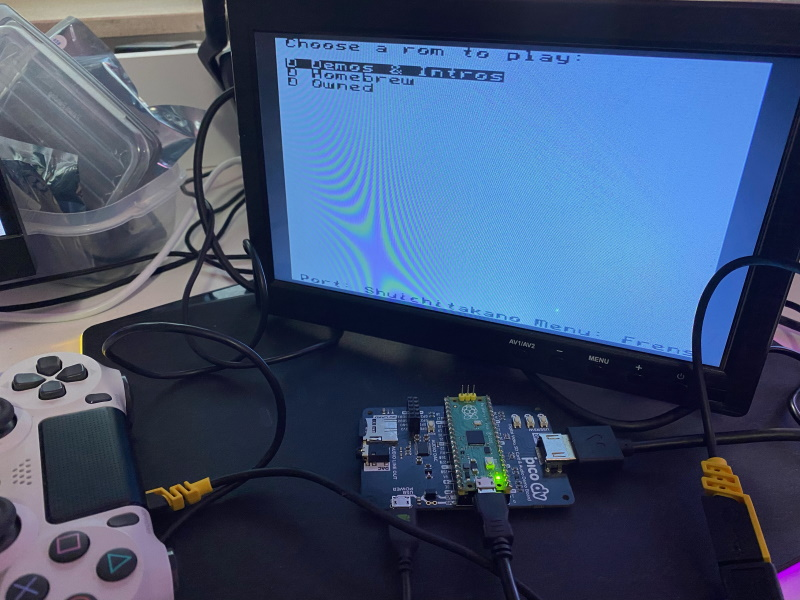

# pico-infonesPlus
A NES Emulator for the Raspberry PI Pico with SD card and menu support, for use with the [Pimoroni Pico DV Demo Base](https://shop.pimoroni.com/products/pimoroni-pico-dv-demo-base?variant=39494203998291) hdmi add-on board.

The emulator used is the [Raspberry PI Pico port of InfoNES by Shuichi Takano](https://github.com/shuichitakano/pico-infones) with some minor changes to accomodate the SD card menu.

In stead of flashing a NES rom to the Pico using picotool, you create a FAT32 formatted SD card and copy your NES roms on to it. It is possible to organise your roms into different folders. Then insert the SD Card into the card slot of the Pimoroni Pico DV Demo base.

A menu is added to the emulator, which reads the roms from the SD card and shows them on screen for the user to select,  flash and play.

Click on image below to see a demo video.

## Warning
Repeatedly flashing your Pico will eventually wear out the flash memory. 

The emulator overclocks the Pico in order to get the emulator working fast enough. Overclocking can reduce the Pico's lifespan.

Use this software at your own risk! I will not be responsible in any way for any damage to your Pico and/or connected peripherals caused by using this software.

## Controller support
The emulator supports these controllers:

- Sony Dual Shock 4
- Sony Dual Sense
- BUFFALO BGC-FC801

## Pico setup

### materials needed
- Raspberry Pi Pico (not W!), with soldered headers.
- [Pimoroni Pico DV Demo Base](https://shop.pimoroni.com/products/pimoroni-pico-dv-demo-base?variant=39494203998291).
- Dual Shock 4 or Dual Sense Controller.
- USB OTG cable.
- HDMI Cable.
- USB power adapter.
- Micro Usb cable.
- USB C cable when using the Sony Dual Sense controller.
- FAT 32 formatted Micro SD card with roms you legally own. Roms must have the .nes extension. You can organise your roms into different folders.

### flashing the Pico
- Download picoNesPlus.uf2 from the [releases page](https://github.com/fhoedemakers/pico-infonesPlus/releases/latest).
- Push and hold the BOOTSEL button on the Pico, then connect to your computer using a micro USB cable. Release BOOTSEL once the drive RPI-RP2 appears on your computer.
- Drag and drop the UF2 file on to the RPI-RP2 drive. The Raspberry Pi Pico will reboot and will now run the emulator.

### setting up the hardware
- Disconnect the Pico from your computer.
- Attach the Pico to the DV Demo Base.
- Connect the HDMI cable to the Demo base and your monitor.
- Connect the USB OTG cable to the Pico's usb port.
- Connect the controller to the other end of the USB OTG.
- Insert the SD card into the SD card slot.
- Connect the USB power adapter to the usb port of the Demo base.

## Menu Usage
Gamepad buttons:
- UP/DOWN: Next/previous item in the menu.
- LEFT/RIGHT: next/previous page.
- A (Circle): Open folder/flash and start game.
- B (X): Back to parent folder.
- START: Starts game currently loaded in flash.

## Emulator 
Gamepad buttons:
- SELECT + START: Resets back to the SD Card menu. Game saves are saved to the SD card.

## Save games
For games which support it, saves will be stored in the /SAVES folder of the SD card. Caution: the save ram will only be saved back to the SD card when quitting the game via (START + SELECT)

## Raspberry Pico W support
The emulator does not work with the Pico W.

## Known Issues and limitations
- Audio through the audio out jack is not supported, audio only works over hdmi.
- Some TV's don't support the hdmi signal (Like my Samsung TV).
- Due to the Pico's memory limitations, not all mappers are supported.
- tar file support is removed.

## Building from source
The emulator and menu system take almost the whole ram. Therefore, the Release build is too big to fit into the Pico's ram, and cannot be used. Also the MinSizeRel (Optimise for smallest binary size) build is not suitable, because it makes the emulator too slow.

Best is to use the included build script [build.sh](https://github.com/fhoedemakers/pico-infonesPlus/blob/main/build.sh). You can then copy the.uf2 to your Pico via the bootsel option.

When using Visual Studio code, choose the RelWithDebInfo or the Debug build variant.

## Acknowledgements
The InfoNes emulator part of this software is ported to the Raspberry PI Pico by [Shuichi Takano](https://github.com/shuichitakano/pico-infones). He is the author of the emulator port.

I contributed by adding SD card and menu support. For this reasons I did minor code changes to the emulator for accommodating the menu and SD card.

